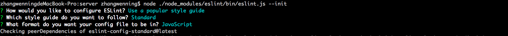

建立server 项目

1、`npm init -f`	// 初始化项目, package.json 文件默认初始化

2、npm i --save nodemon eslint	// 安装两个依赖	

3、 修改package.json文件中的东东，

 "start" : "./node_modules/nodemon/bin/nodemon.js src/app.js --exec 'npm run lint && node'",
 "lint" : "./node_modules/.bin/eslint **/*.js"

但是报错啦，

```
ESLint couldn't find a configuration file. To set up a configuration file for this project, please run:
```



4、但是以下这两个依赖是属于开发时需要的，因此放到`devDependencies`比较合适
```
 "eslint": "^4.18.2",
  "nodemon": "^1.17.1"
``